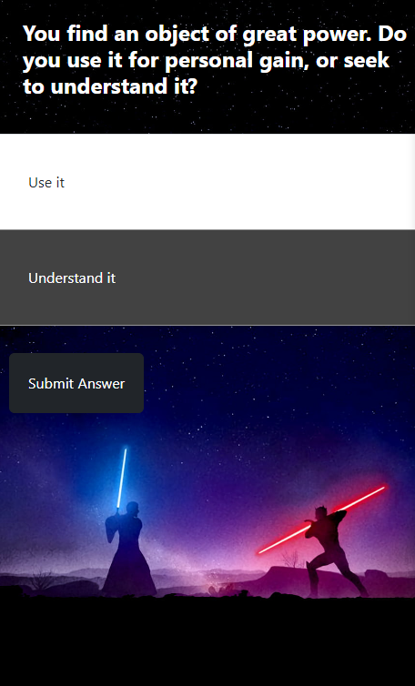

# Star Wars Side of the Force Quiz

## Project Overview

The Star Wars Side of the Force Quiz is an interactive web application that invites users to find out whether they lean towards the light side or the dark side of the Force based on their answers to a series of moral and ethical questions.

This project is built with TypeScript and React, using React hooks for state management, and utilizes CSS (with Bootstrap) for a responsive and user-friendly design.

## Changelog

- v1.0 (2023-06-08) Initial release of Star Wars Quiz.

## Demo

{:height="300px" width="500px"}

## Technologies Used

- TypeScript
- React
- CSS (Bootstrap)

## Features

- Interactive quiz questions that guide users through the journey.
- Final results page that reveals user's alignment (Light side, Dark side, or Grey) based on their responses.
- Retake quiz button that allows the user to reset the quiz and start over.
- Responsive design that adapts to different screen sizes.

## Project Structure

```
|-- star-wars-quiz/
| |-- dist/
| | |-- assets/
| | | |-- index-....js
| | | |-- index-....css
| | |-- index.html
| |-- node_modules/
| | |-- ...
| |-- public/
| |-- src/
| | |-- assets/
| | | |-- react.svg
| | |-- components/
| | | |-- Question.tsx
| | |-- App.css
| | |-- App.tsx
| | |-- index.css
| | |-- main.tsx
| | |-- vite-env.d.ts
|-- .eslintrc.cjs
|-- .gitignore
|-- index.html
|-- package-lock.json
|-- package.json
|-- README.md
|-- tsconfig.json
|-- tsconfig.node.json
|-- vite.config.ts
```

## Development Process

Starting with a basic understanding of TypeScript and React, this project served as an opportunity to delve deeper into React hooks, TypeScript interfaces, and how to create dynamic and reusable components.

Challenges encountered during the development process included:

- **State Management:** Initially, tracking the selected answer and resetting it for each question was a hurdle. The solution came with using React's useState hook, which allowed me to reset the selected answer state after each question.

- **Rendering Questions:** Another challenge was how to render the current question and switch to the next one upon submission. This was resolved by utilizing the spread operator to pass in the current question object as props to the Question component.

- **Scoring:** The scoring mechanism to determine the alignment of the user based on their answers was another challenge. The solution came with attaching a value ('light', 'dark', 'neutral') to each answer and adjusting the overall score based on these values. The final score determined the user's alignment.

- **Responsive Background Image:** On the results page, setting a full-screen, responsive background image according to the user's alignment was initially tricky. This was resolved by using CSS properties such as `background-size: cover`.

- **Retake Quiz:** Implementing a "Retake Quiz" button that resets the app back to the first question and resets the score required careful thought around state management.

## Future Enhancements

In the future, we plan to add the following enhancements:

- More complex scoring mechanisms for more personalized results.
- Shareable results for social media platforms.
- Animated transitions for a smoother and more engaging experience.
- Improved UI design for better user experience.
- A cover page that asks "Which side of the Force are you on?" and then directs the user to the quiz.

## Getting Started

To run the Star Wars Quiz locally, follow these steps:

1. Clone the project repository: `git clone https://github.com/Ryan-Biondo/star-wars-quiz`
2. Navigate to the project directory: `cd star-wars-quiz`
3. Install the dependencies: `npm install`
4. Start the application: `npm start`
5. Open your browser and visit `http://localhost:3000`.

## Usage

This project is open for public use.

## Contributing

Contributions to this project are currently not accepted. However, if you have any suggestions or feedback, please feel free to reach out to me.

## License

All rights reserved. This project's code and content are protected under copyright law. You may not reproduce, modify, or distribute the code or content without explicit permission from the project author.

## Acknowledgments

- OpenAI's GPT-4 model for generating engaging quiz questions.
- Star Wars for the endless inspiration.
